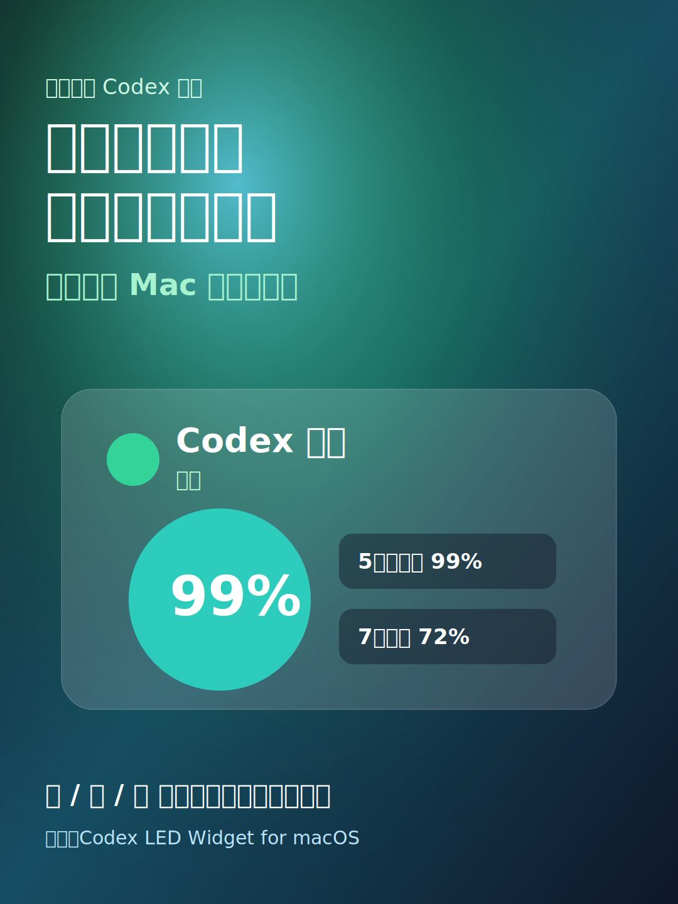
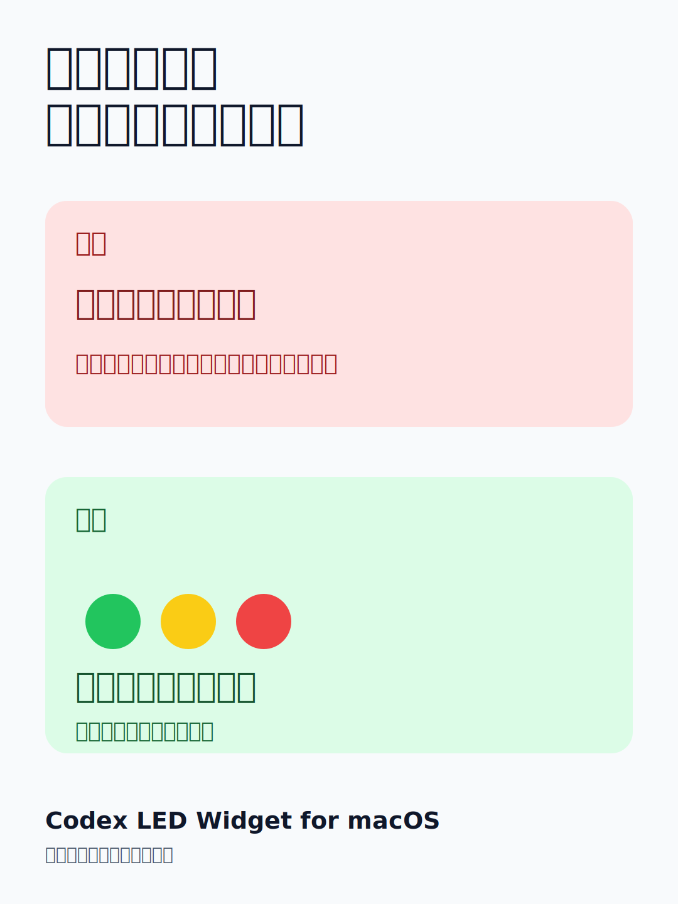
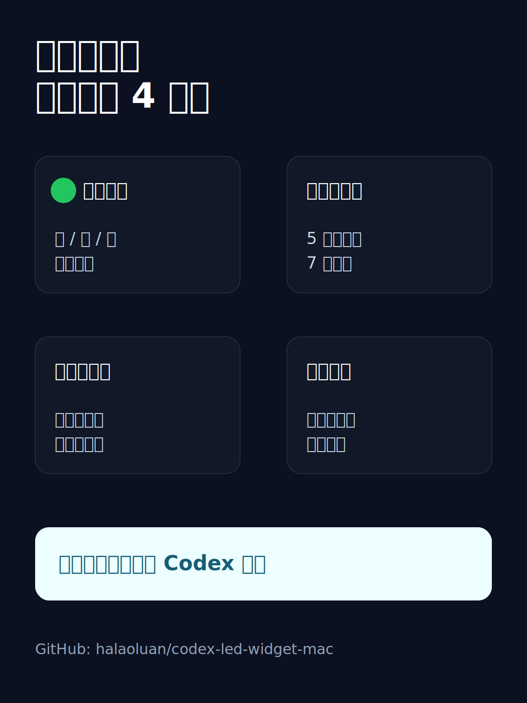

# 小红书高互动版宣传文案

这份文案适合小红书、视频号、朋友圈、即刻等偏生活化平台。重点不是介绍 GitHub 项目，而是先讲真实痛点，再展示“用了之后省心”的变化。

## 图片示范

### 封面图示范



封面叠字：

```text
别再一天打开十几次额度页了
我做了个 Mac 桌面小组件
```

### 前后对比图示范



### 功能分镜图示范



## 推荐标题

优先用前 5 个，点击感更强：

1. `别再一天打开十几次 Codex 额度页了`
2. `每天用 Codex 的人，真的需要这个桌面小组件`
3. `我把 Codex 额度做成了 Mac 桌面红绿灯`
4. `这个小工具，治好了我反复查 Codex 额度`
5. `高频用 Codex 后，我给自己做了个额度提醒`
6. `Mac 桌面终于能直接看 Codex 剩余额度了`
7. `写代码写到一半，不想再去翻额度页了`
8. `给 Codex 重度用户做了一个小东西`

## 图文笔记版本 A：痛点强烈版

适合第一次正式发布。

```text
我真的受够了反复打开 Codex 额度页。

最近每天都在高频用 Codex，写一会儿就想确认：

还剩多少额度？
什么时候恢复？
还能不能继续写？

一天打开十几次页面，越用越烦。

所以我干脆做了一个 Mac 桌面小组件：
Codex LED Widget。

它就像桌面上的一个小红绿灯：

🟢 绿色：可用，剩余额度 >= 10%
🟡 黄色：偏低，剩余额度 < 10%
🔴 红色：已用尽，剩余额度 = 0

额度恢复以后，会自动变回绿色。

我自己最喜欢的点：

1. 不用再反复打开网页
2. 5 小时和 7 天窗口都能看
3. 有恢复倒计时
4. 小 / 中 / 大尺寸都能调
5. 中英文都支持
6. 可以像天气组件一样常驻桌面

隐私这块我也比较在意，所以它只从本机已经登录的 Codex 读取额度，不上传账号数据，也不会展示 token。

目前还是早期版本，先开源出来给同样高频用 Codex 的朋友试试。

GitHub 搜：Codex LED Widget for macOS
```

置顶评论：

```text
开源地址：
https://github.com/halaoluan/codex-led-widget-mac

下载最新版 DMG：
https://github.com/halaoluan/codex-led-widget-mac/releases/latest

目前主要验证了 Apple Silicon Mac，Intel Mac / 签名 / Homebrew 还在计划里。
```

## 图文笔记版本 B：工具分享版

适合小红书“效率工具”风格。

```text
分享一个我自己做的 Mac 小工具。

适合人群很明确：

每天都在用 Codex，
又总是忍不住去查额度的人。

以前我的流程是：
写一会儿代码 → 打开额度页 → 看还剩多少 → 继续写 → 又不放心 → 再打开一次。

现在直接看桌面右上角。

🟢 可用
🟡 偏低
🔴 已用尽

不用想，不用算，也不用切页面。

它还会显示：

- 5 小时窗口剩余比例
- 7 天窗口剩余比例
- 什么时候恢复
- 当前套餐标签
- 小 / 中 / 大三种尺寸

我做成了液态玻璃风格，放在桌面上不会太突兀。

如果你也是 Codex 重度用户，应该会懂这个小东西的快乐。

项目已经开源。
名字：Codex LED Widget for macOS
```

置顶评论：

```text
GitHub：
https://github.com/halaoluan/codex-led-widget-mac

欢迎提 issue，尤其是 macOS 桌面常驻、安装体验、套餐显示这些问题。
```

## 图文笔记版本 C：开发记录版

适合偏技术读者。

```text
做了一个很小但每天都会用的工具。

背景：
我最近几乎每天都在用 Codex。

真正让我决定动手的，不是什么大功能，而是一个很小的烦躁点：

我总是在查额度。

剩多少？
什么时候重置？
现在还能不能继续？

于是我把这个状态做成了 macOS 桌面小组件。

设计上只保留最重要的信息：

🟢 可用
🟡 偏低
🔴 已用尽

再加两个窗口：

- 5 小时窗口
- 7 天窗口

技术上它读取本机 Codex 的额度信息，不上传账号数据，也不把 token 放到界面里。

现在支持：

- macOS 桌面常驻
- 折叠成小胶囊
- 中文 / 英文
- 小 / 中 / 大尺寸
- Free / Go / Plus / Pro / Business / Team / Enterprise 套餐标签

已经开源，欢迎同样用 Codex 的朋友试试。
```

置顶评论：

```text
项目地址：
https://github.com/halaoluan/codex-led-widget-mac

如果你遇到额度读取、桌面常驻、最小化/折叠、套餐显示问题，可以直接在 GitHub 提 issue。
```

## 九宫格图片脚本

小红书建议不要只发一张截图。按下面 6 张图来发，信息会更完整：

1. 封面：大字痛点  
   `别再一天打开十几次额度页了`

2. 桌面效果图  
   用真实 Mac 桌面截图，右上角放小组件。

3. 前后对比图  
   `之前：反复打开网页`  
   `现在：看桌面红绿灯`

4. 功能图  
   `5 小时窗口 / 7 天窗口 / 恢复倒计时 / 小中大尺寸`

5. 隐私图  
   `本机读取，不上传账号数据，不展示 token`

6. 下载图  
   `GitHub 搜：Codex LED Widget for macOS`

## 15 秒视频脚本

```text
0-2 秒：
字幕：每天用 Codex 的人都懂
画面：打开额度页面

2-5 秒：
字幕：我之前一天能查十几次额度
画面：切来切去看网页

5-9 秒：
字幕：所以做了个 Mac 桌面小组件
画面：展示桌面右上角组件

9-12 秒：
字幕：绿=可用 黄=偏低 红=已用尽
画面：展示状态灯和百分比

12-15 秒：
字幕：开源：Codex LED Widget for macOS
画面：GitHub 页面或下载页
```

## 发布标签

```text
#效率工具 #Mac软件 #程序员日常 #AI工具 #Codex #ChatGPT #开源项目 #桌面小组件 #独立开发 #开发者工具
```

## 注意

- 不要在正文里直接写“求点赞求收藏”。可以写“需要的可以收藏，后面我继续更新安装和使用问题”。
- 不要把 GitHub 链接塞进封面。封面只负责让人点进来。
- 正文第一屏先讲痛点，不要先讲技术实现。
- 置顶评论放下载链接，比正文里一上来放链接更自然。
